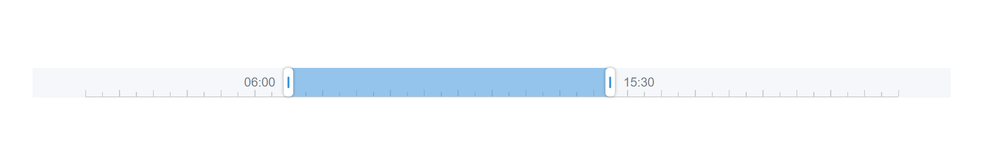

### React timeline range slider



### Installation

     yarn add @glav-kod/react-timeline-range-slider

### Props

| Prop             | Type     | Default | Description                           |
|------------------|----------|---------|---------------------------------------|
| selectedInterval | Object   |         | Selected interval inside the timeline |
| onChangeCallback | function |         |                                       |

### Example

```javascript
import React, {useState} from "react";
import TimeRange, {TimelineInterval} from "@glav-kod/react-timeline-range-slider";
import "./App.css";

const initialInterval = TimelineInterval.FromString("06:00", "15:30");

function App() {
    const [selectedInterval, setSelectedInterval] = useState<TimelineInterval>(initialInterval);

    function onChangeCallback(selectedInterval: TimelineInterval) {
        setSelectedInterval(selectedInterval);
    }

    return (
            <TimeRange
                    selectedInterval={selectedInterval}
                    onChangeCallback={onChangeCallback}
            />
    );
}

export default App;
```
